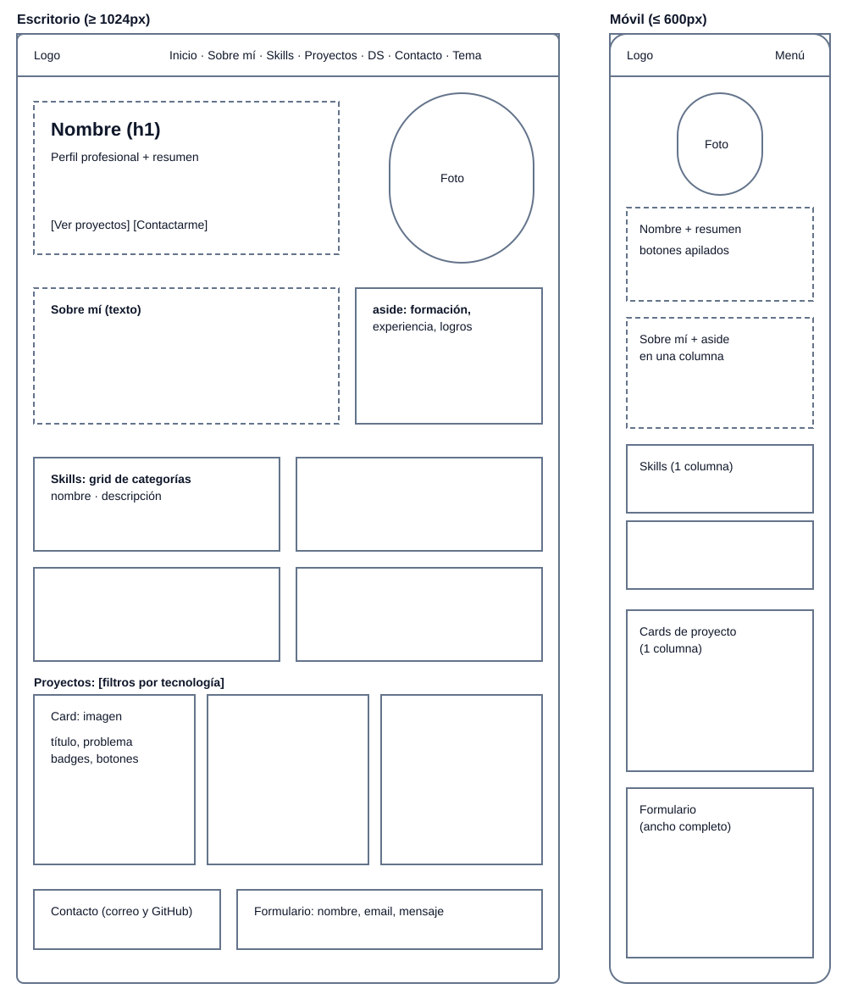
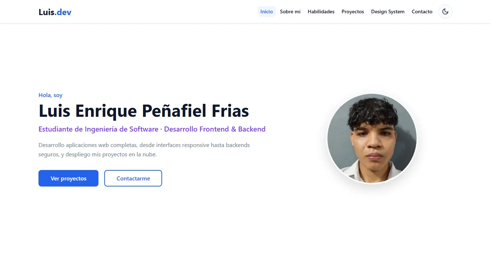
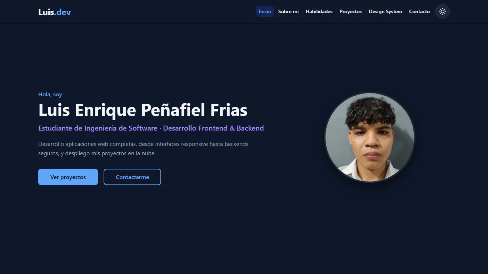
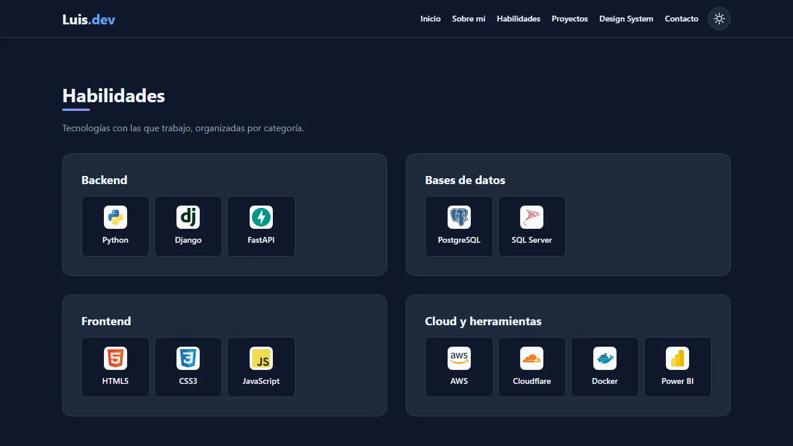
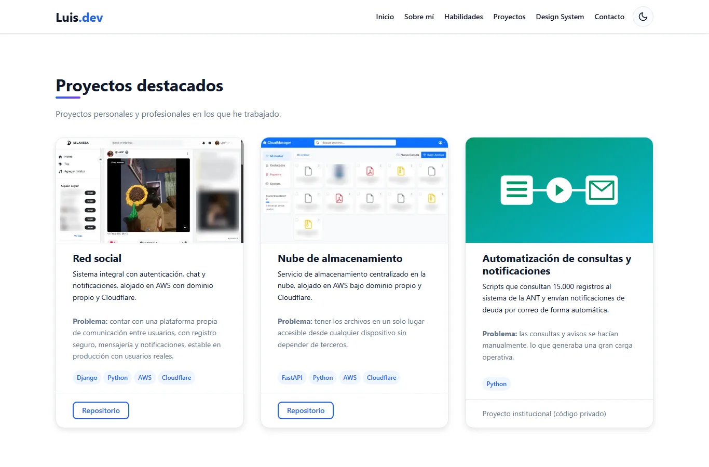
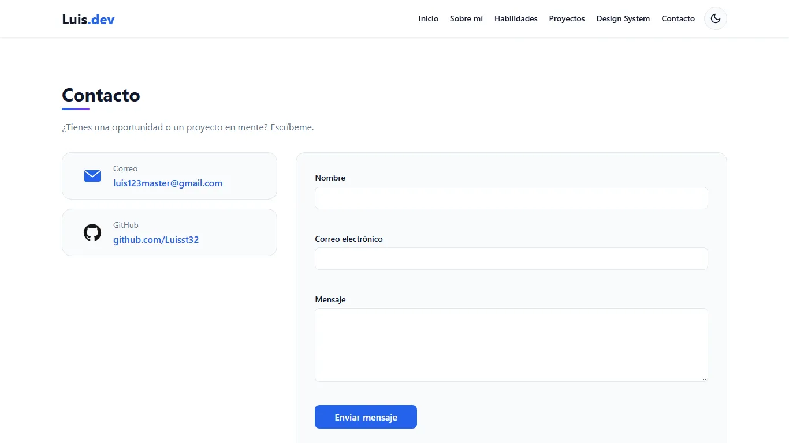
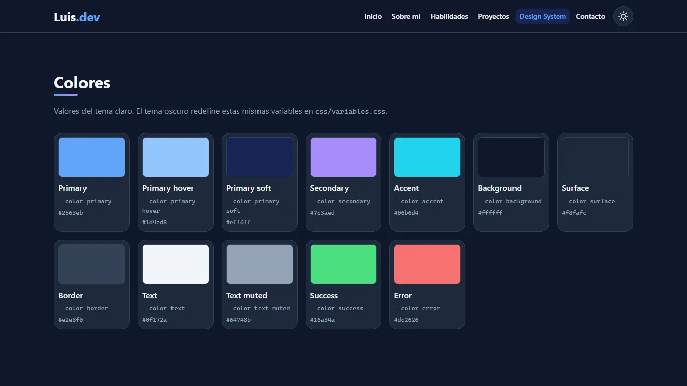
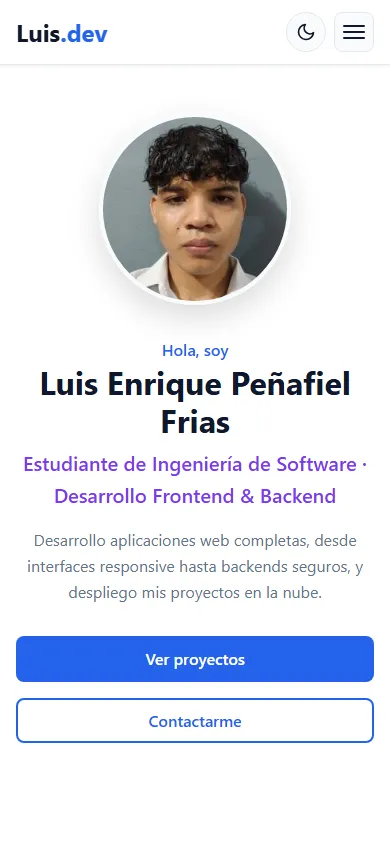
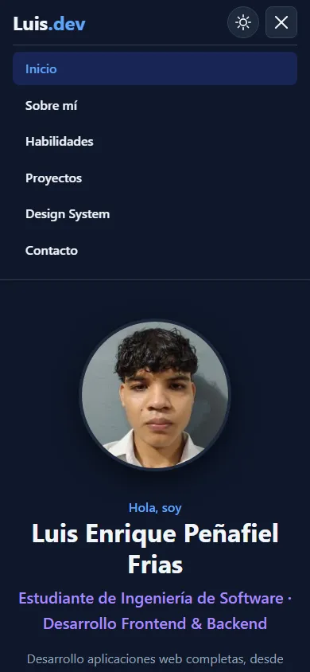

# Portafolio – Luis Enrique Peñafiel Frias

Portafolio web personal e interactivo de un estudiante de Ingeniería de Software (UNEMI),
enfocado en desarrollo frontend y backend. Presenta información académica y profesional,
habilidades técnicas, proyectos destacados, un Design System documentado y un formulario de contacto.

**Sitio publicado:** https://luisst32.github.io/portafolio_interactivo/

## Tecnologías

- **HTML5 semántico:** `header`, `nav`, `main`, `section`, `article`, `aside`, `figure`, `address`, `footer`.
- **CSS propio:** Custom Properties (design tokens), Flexbox, CSS Grid, media queries y unidades relativas. Sin frameworks.
- **JavaScript (vanilla):** interactividad y persistencia de preferencias con `localStorage`.

## Funcionalidades con JavaScript

| Funcionalidad | Descripción |
|---|---|
| Menú responsive | En pantallas pequeñas el menú se despliega con un botón; se cierra al elegir una sección o con la tecla Escape. |
| Tema claro y oscuro | Botón en el navbar que cambia el tema. La elección se guarda en `localStorage` y, si no hay una guardada, se usa la preferencia del sistema. |
| Validación y envío del formulario | Valida nombre, correo y mensaje, muestra los errores debajo de cada campo y envía el mensaje con `fetch` mediante FormSubmit. |

## Boceto

Antes de maquetar se definió la distribución de las secciones en escritorio y móvil:



## Diseño responsive

El CSS sigue un enfoque *mobile first* con varios puntos de quiebre:

| Dispositivo | Ancho | Distribución |
|---|---|---|
| Teléfono | menos de 640px | Una columna y menú desplegable |
| Tablet | desde 640px (`40rem`) | Habilidades y proyectos en 2 columnas |
| Tablet horizontal | desde 832px (`52rem`) | Menú completo visible en el navbar |
| Computadora | desde 1024px (`64rem`) | Inicio en 2 columnas y proyectos en 3 |

## Estructura del proyecto

```
index.html            Página principal (Inicio, Sobre mí, Habilidades, Proyectos, Contacto)
design-system.html    Documentación del sistema visual y componentes
css/variables.css     Design tokens del tema claro y del tema oscuro
css/base.css          Reset, tipografía y utilidades
css/layout.css        Estructura de secciones, grids y media queries
css/components.css    Componentes reutilizables (navbar, botones, badge, skill, card, formulario)
css/design-system.css Estilos propios de la página Design System
js/theme.js           Aplica el tema guardado antes de mostrar la página
js/main.js            Funcionalidades interactivas del sitio
assets/img/           Fotografía, capturas de proyectos (WebP) e ilustración (SVG)
assets/icons/         Logos de tecnologías (Devicon, licencia MIT)
docs/                 Boceto y capturas del resultado
```

## Cómo visualizarlo

- **En línea:** abrir https://luisst32.github.io/portafolio_interactivo/
- **En local:**
  1. Clonar el repositorio: `git clone https://github.com/Luisst32/portafolio_interactivo.git`
  2. Abrir `index.html` en el navegador, o usar la extensión **Live Server** de VS Code
     (clic derecho sobre `index.html` → *Open with Live Server*).

No requiere instalación ni dependencias.

## Capturas

### Escritorio

| Tema claro | Tema oscuro |
|---|---|
|  |  |









### Móvil

| Inicio | Menú desplegado |
|---|---|
|  |  |

## Privacidad

El sitio no publica datos personales sensibles (teléfono, dirección, documentos). En las capturas
de los proyectos se desenfocaron los datos de otros usuarios y los nombres de archivos.
